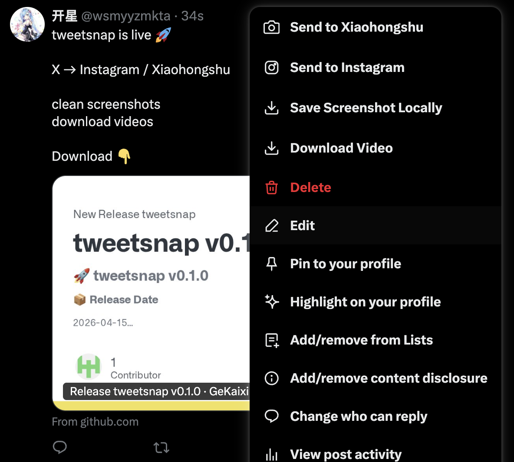
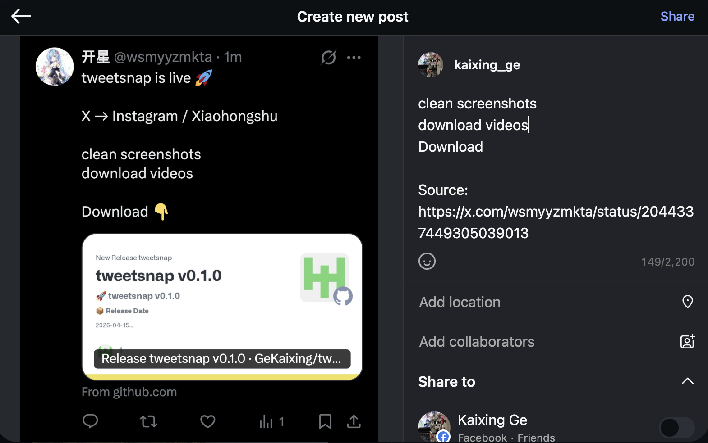

# tweetsnap

一个用于 **X / Twitter、Instagram、小红书** 的 Chrome 扩展，核心目标是把内容搬运流程做成一键化。

## 使用截图

### X 菜单入口

### Instagram 自动填充效果

## 主要能力

- 在 X/Twitter 推文三点菜单中新增：
  - `发送到小红书`
  - `发送到 Instagram`
  - `截图保存到本地`
  - `下载视频`
- 推文截图按移动端宽度渲染（更适配社媒发布）
- 小红书自动填充图文（图片 + 标题 + 正文）
- Instagram 自动填充贴文（图片 + 描述，最终发布建议手动确认）
- Instagram 帖子三点菜单支持 `分享到X`
  - 自动打开 X 发帖页
  - 自动填充文案
  - 自动上传媒体（按顺序，最多 4 个）

## 安装（开发者模式）

1. 打开 `chrome://extensions`
2. 右上角开启“开发者模式”
3. 点击“加载已解压的扩展程序”
4. 选择本项目目录

## 使用说明

### X/Twitter -> 小红书

1. 打开任意推文
2. 点击推文右上角三点
3. 点击 `发送到小红书`
4. 扩展会自动截图并打开小红书创作页，随后自动填充

### X/Twitter -> Instagram

1. 打开任意推文
2. 点击推文右上角三点
3. 点击 `发送到 Instagram`
4. 扩展会自动截图并跳转 Instagram 发帖流程

### Instagram -> X

1. 在 Instagram 帖子中点击右上角三点
2. 在菜单中点击 `分享到X`
3. 扩展会自动跳转 X 发帖页并填充文案与媒体

### 本地保存 / 视频下载

- `截图保存到本地`：直接下载当前推文截图
- `下载视频`：优先尝试高码率 mp4，失败时走页面视频源兜底

## 限制与说明

- X 对媒体有平台限制，当前自动上传按最多 4 个媒体处理
- 部分 Instagram 视频源可能受权限或跨域限制，可能提示暂不支持
- 社媒页面结构会变动，选择器可能需要随平台更新

## 核心文件

- `manifest.json`：扩展配置
- `content.js`：X/Twitter 页功能与自动填充
- `background.js`：后台消息、下载与跨页操作
- `xhs-autofill.js`：小红书自动填充
- `instagram-autofill.js`：Instagram 自动填充与分享到 X

## License

MIT
